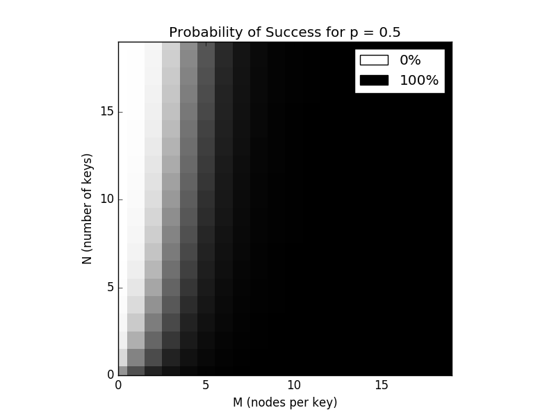

# P2P Time Release Encryption Proposal

## Abstract

Time release encryption (TRE) is a class of techniques for encrypting messages in such a way that they can only be decrypted after a certain period of time. This is typically achieved one of two ways, either
1. a trusted third party publishes the decryption key once a determined deadline has elapsed or
1. the message is encrypted in such a way that the time required to expose the plaintext through a brute force attack is longer than that which one wants to keep the message secret.

An interesting property of both of these TRE approaches is that they are non-interactive, ie the sender of the encrypted message is not required to be available for decryption.
This article describes a general technique for time release encryption using a peer-to-peer protocol which doesn't necessitate trusted parties or high computational expenditure while remaining non-interactive.

## Steps

**PEER NODES**
1. Each node publishes their public key to the network.

**SENDER**
1. Creates `N` secret strings each 256B long. `SECRET_STRINGS = [ss1, ss2, ...]`
2. Hashes the concatenated strings to produce a secret key. `SECRET_KEY = ss1 + ss2 + ...`
3. Uses this key to symmetrically encrypt some data.
```
  CIPHERTEXT = AES(message: PLAINTEXT, key: SECRET_KEY)
```
4. Publishes the encrypted data to the network viewable by anyone.
5. Disseminates secret string, the concatenation index, and a release date for each secret string to `N` random nodes. A given node might receive:
```json
  {
    sender: <address>,
    key: ss143,
    index: 143,
    release: "2018-07-20"
  }
```
If the network transactions occur over a blockchain the sender must encrypt the data via the node's public key and may provide a mechanism for remuneration if the node participates in the future decryption.
6. Repeat the previous step `M` times (`M * N` _total nodes are sent data_).

**SOLICITED NODES**
1. Each node that receives data is requested to store the data until the release date has elapsed before publishing the decrypted contents to the network.

## ANALYSIS

If not already obvious, the described TRE scheme is a _heuristic_ which comes with no guarantees. When using this proposal there are 3 possible outcomes:
1. The nodes conspire unilaterally against you and the message is hacked before the release date.
1. Enough nodes fail to publish their keys such that the entire symmetric key cannot be recreated and the message is never decrypted.
1. At least one copy of each indexed key is published after the deadline successfully decrypting the message.

The probability `P` that this strategy will succeed conforms to the following formula:
```
𝚷ᵢ·(1 - 𝚷ᵣ·(1 - pᵢᵣ))
```
`𝚷ᵢ` and `𝚷ᵣ` are the sequence products `i = 0`, `i < N` and `r = 0`, `r < M` respectively. `pᵢᵣ` refers to the probability that the `r`th node with key `i` will faithfully publish key `i` after the release date.




Key: white = 0% | black = 100%

Derivation of `P`. Trivially,
```
  P = 𝚷ᵢ·pᵢ
```
where `pᵢ` is the probability that at least one node with key `i` decrypts after the release date.

```
pᵢ = 1 - cᵢ
```

`cᵢ`, the complement of `pᵢ`, is the probability that all nodes with key `i` fail to decrypt.

```
cᵢ = 𝚷ᵣ·cᵢᵣ
```
`cᵢᵣ`, the probability that `pᵢᵣ` will fail, can be rewritten as `1 - pᵢᵣ`.

Copyright © 2018 Jake Wood
